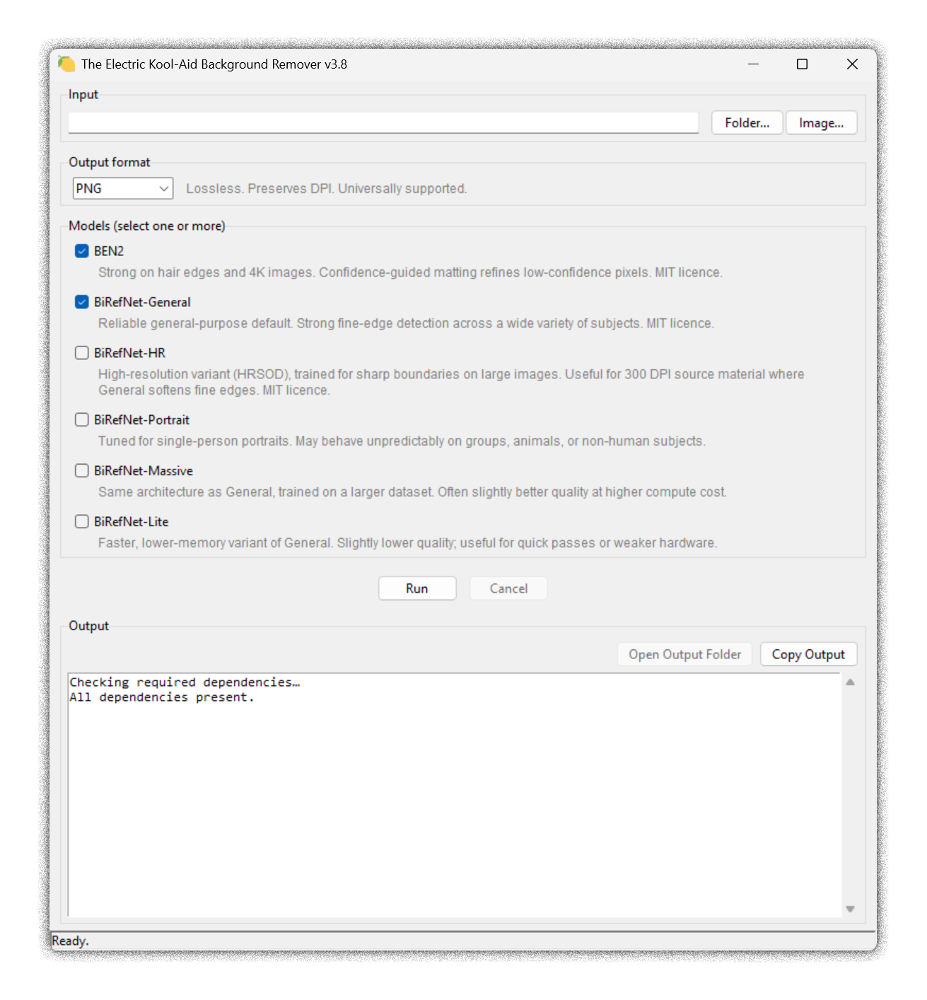

# The Electric Kool-Aid Background Remover

**TL;DR:** A designer got fed up with remove.bg (expensive), Figma and Photoshop background removal (crap results), the privacy and ethical concerns of uploading colleagues' photos to cloud AI services, and messing around with command line tools every time they JUST WANTED TO REMOVE A BACKGROUND. So they built this. Drop your images in a folder, pick your models, click Run. Everything stays on your machine.

**No idea what any of the technical stuff below means?** Download [GET-AI-HELP.md](GET-AI-HELP.md), paste it into [Claude](https://claude.ai) or ChatGPT, and ask your question. It contains everything an AI needs to walk you through installation and usage from scratch.

---

## Getting started

Download the zip from the [releases page](https://github.com/dragnim/The-Electric-Kool-Aid-Background-Remover/releases), unzip it, and **double-click `launch.bat`**. That's it.

`launch.bat` handles everything — checking for Python, offering to install it if needed, detecting your GPU, and launching the app. The other files in the folder are helpers; you don't need to run them directly.

---

## What is this tool?

A free, local, privacy-respecting background remover for Windows. Runs
entirely on your own machine - no cloud upload, no subscription, no
images sent anywhere.

Supports batch processing of whole folders or single images, with a choice
of seven AI models so you can find the one that works best on your material.
Output is PNG, TIFF, or WebP with transparency preserved and DPI metadata
carried through - ready for web, print, or further editing.

Originally built for high-resolution professional photography where edge
quality on hair, glasses, and complex backgrounds matters - but in reality
you can run anything through it. Just try it and see.



## What this tool is not

- **Not a web service.** Everything runs locally; nothing is uploaded anywhere.
  This is the point.
- **Not a compression tool.** All output formats are configured for maximum
  quality and lossless encoding. PNG and TIFF are inherently lossless.
  WebP output also uses lossless mode - the files are smaller than PNG
  due to better compression, not because quality has been sacrificed.
  None of the outputs are "web-optimised" in the sense of being compressed
  for fast page loads; they are full-quality cutouts intended for further
  use in design, print, or web pipelines where you control the final
  compression step.
- **Not a traditional installer.** There is no `.exe` or `.msi`. Instead,
  `launch.bat` handles setup transparently — it checks for Python, offers
  to install it locally if needed, detects your GPU, and launches the app.
  PyTorch alone would make a bundled `.exe` several GB; the current approach
  keeps things honest and auditable.
- **Not cross-platform.** The auto-install assumes Windows. The underlying
  Python code is not Windows-specific and could plausibly run on macOS or
  Linux with manual dependency setup, but is not tested there.
- **Not fast.** A 24 MP image on CPU takes 10–30 seconds per model. If you
  need speed, see the Tips section on GPU support.

## What it does

Pick a folder of images **or a single image**, pick a format, tick the
model(s) you want to use, and hit Run. The app removes the background from
every image and saves transparent cutouts into labelled subfolders next to
your input.

Output is PNG, TIFF, or WebP (your choice). All three are lossless and
preserve the source image's DPI metadata. TIFF uses LZW compression; WebP
files are typically 25–35% smaller than PNG. Existing outputs are skipped
on re-runs, so interrupted batches can be safely resumed.

## Why are there different models?

No single AI model is best at everything. Some are better at fine details
like hair and fur, some handle complex backgrounds better, some are tuned
specifically for portraits. They've all been trained differently, on
different datasets, with different goals.

In practice this means one model might give you a clean cut on a headshot
but leave a messy edge on a photo with flyaway hair, while another handles
the hair perfectly but struggles with a busy background. There's no way to
know in advance which will work best on your specific images - just try
them all and compare.

## Models included

All bundled models are permissively licensed (MIT) and suitable for
commercial use.

- **[BEN2](https://github.com/PramaLLC/BEN2)** - strong on fine edges like hair; good default for portrait or
  product photography.
- **[BiRefNet-General](https://huggingface.co/ZhengPeng7/BiRefNet)** - reliable general-purpose model; the safe default
  for mixed subject matter.
- **[BiRefNet-HR](https://huggingface.co/ZhengPeng7/BiRefNet-HRSOD-DHU)** - high-resolution variant. Worth trying on large
  source images (e.g. 24 MP professional photography) where General can
  soften fine edges.
- **[BiRefNet-Portrait](https://huggingface.co/ZhengPeng7/BiRefNet-portrait)** - tuned specifically for single-person portraits.
  Can behave unpredictably on group photos or non-human subjects.
- **[BiRefNet-Massive](https://huggingface.co/ZhengPeng7/BiRefNet_massive)** - same architecture as General, trained on more
  data. Often slightly better quality at higher compute cost.
- **[BiRefNet-Lite](https://huggingface.co/ZhengPeng7/BiRefNet-lite)** - faster, lower-memory variant of General. Slightly
  lower quality; useful for quick passes or weaker hardware.
- **[InSPyReNet](https://github.com/plemeri/transparent-background)** - a different architecture entirely (pyramid-based
  salient object detection). Worth running alongside BEN2 and BiRefNet on
  tricky material since it can disagree with both in useful ways. Installed
  lazily on first use rather than at startup, because the install can fail
  on Python 3.14 due to a transitive dependency (`stringzilla`) that needs
  a C++ compiler. If install fails, the rest of the app still works -
  just stick to the other six models, or switch to Python 3.12.

BEN2 and BiRefNet-General are selected by default. Tick others as needed
to compare.

## Requirements

- Windows 10 or 11.
- Python 3.12 or newer. Python 3.14 is tested and works.
- ~5 GB of free disk space for model weights and PyTorch on first run.
- A GPU is **not** required. The tool runs on CPU by default and uses CUDA
  automatically if a compatible NVIDIA GPU is present.

## Installation

### Easiest: double-click launch.bat

Download the zip from the [releases page](https://github.com/dragnim/The-Electric-Kool-Aid-Background-Remover/releases),
unzip it, and double-click `launch.bat`. It will check for Python,
offer to install it locally if needed, and start the app.

**Windows security warning:** Windows will show a security warning the
first time you run `launch.bat` because it was downloaded from the
internet and is not code-signed. This is normal for open-source tools
that aren't commercially signed. The bat file does exactly what it says —
you can read every line of it in a text editor before running. Click
**Run** to continue.

### Quickest safe install

```powershell
git clone https://github.com/dragnim/The-Electric-Kool-Aid-Background-Remover.git
cd The-Electric-Kool-Aid-Background-Remover
py -m venv .venv
.venv\Scripts\activate
pip install -r requirements.txt
py the-electric-kool-aid-background-remover.py
```

### Recommended for most users: virtual environment

A virtual environment keeps the dependencies isolated from the rest of your
Python installation and gives you a reproducible setup from pinned versions.

```
py -m venv .venv
.venv\Scripts\activate
pip install -r requirements.txt
py the-electric-kool-aid-background-remover.py
```

`requirements.txt` contains pinned versions from a known-working environment
(Python 3.14.3, Windows 11, May 2026). See the file for notes on GPU support.

### Quick start (for your own machine, installs into system Python)

If you just want to get going and aren't worried about dependency isolation:

1. Install Python from <https://www.python.org/downloads/> if you don't
   already have it. During install, tick "Add Python to PATH".
2. Download `the-electric-kool-aid-background-remover.py` and put it
   anywhere convenient.
3. Open a Command Prompt or PowerShell window in that folder and run:

   ```
   py the-electric-kool-aid-background-remover.py
   ```

4. On first launch the app detects missing Python packages (PyTorch, rembg,
   BEN2, Pillow, OpenCV) and offers to install them. Accept; the install
   runs to several gigabytes and can take 10–20 minutes on a reasonable
   connection. Subsequent launches start instantly.

## Usage

1. Pick your input. Click **Folder…** to process every image in a folder,
   or **Image…** to process just one image. Supported formats:
   `.jpg .jpeg .png .webp .tif .tiff .bmp`.
2. Pick an output format from the dropdown (PNG, TIFF, or WebP). A short
   description of each format appears next to the picker.
3. Tick the models you want to run. You can pick one or several.
4. Click **Run** and confirm.
5. Watch the log and the status bar. The progress bar pulses while the
   app is working and the status bar shows which image and model is
   currently being processed (e.g. "Image 3/12 – BEN2…"). Click
   **Cancel** at any time to stop after the current image finishes.
6. When the run finishes, click **Open Output Folder** to go straight to
   the results in Explorer, or look inside the input location manually.
   You'll find subfolders named like `BEN2-PNG`, `BiRefNet-General-WebP`,
   etc., each containing one cutout per input image.

Output filenames carry the model name as a suffix
(`photo_01_BEN2.png`, `photo_01_BiRefNet-General.png`) so the files stay
self-identifying even if you move them out of their folders.

## Tips

- The first time you run a given model, its weights are downloaded
  (300 MB – 1 GB depending on model). Subsequent runs reuse the cached
  weights and start quickly.
- **GPU acceleration:** if you have an NVIDIA GPU, `launch.bat` will detect
  it on first run and offer to install the GPU-accelerated version of
  PyTorch. Processing time drops from 10–30 seconds per image to 1–3
  seconds. The title bar shows `(GPU)` or `(CPU)` so you always know which
  version is active. To switch between CPU and GPU versions after the fact,
  run `cleanup.bat` and choose option 4.
- To find the best model for your material, tick several and compare the
  results. Different images may need different models - there's no single
  right answer.
- The **Copy Log** button above the log copies the entire run
  log to your clipboard - useful for sharing timing data or error messages.
- WebP has a hard 16383px-per-axis size limit. If your source images are
  larger than that on either axis (rare, but possible with very large
  scans or panoramas), the app will refuse to start a WebP run and list
  the oversized files. Pick PNG or TIFF instead, or downscale the input.

## Large batches

The tool handles large batches fine - there's no hard limit on the number
of images. A few things worth knowing if you're processing hundreds of
images:

**It's slow on CPU.** Expect roughly 10–30 seconds per image per model.
1000 images through two models is somewhere around 6–10 hours. If you
have an NVIDIA GPU it drops to 1–3 seconds per image, which makes large
batches much more practical.

**You can always resume.** If the run is interrupted for any reason -
crash, power cut, Windows deciding to restart - just run it again on the
same folder. Any image that already has output in the destination folder
will be skipped. You won't lose progress.

**Split large jobs into smaller batches.** Rather than running 1000 images
in one go, consider splitting into batches of 200–300. Shorter runs are
easier to manage, easier to check, and if something goes wrong you lose
less progress before the next resume point.

**The log gets long.** The log in the app will have thousands of
lines by the end of a big run. It stays functional but may get slightly
sluggish on very large batches. Use the **Copy Log** button to grab
the full log if you need to review it.

**Models are loaded once.** The AI models are loaded into memory at the
start of a run and reused for every image - you don't pay the loading
cost per image. This is the right behaviour for large batches and means
memory usage stays stable throughout the run.

## Freeing up disk space

Run **`cleanup.bat`** for a guided walkthrough of everything the app has
put on your computer and how to remove it. It shows which model weights
are present, their size, how to remove them, and options to switch between
CPU and GPU PyTorch versions.

For manual cleanup, each AI model downloads its weight files the first
time you use it.
The total footprint for all seven models is roughly 5–6 GB. If you
only use a few models regularly, or you're done with the tool entirely,
you can free up space by deleting the cached weights.

The status shown next to each model in the app tells you what's
downloaded and roughly how much space it's using. The **×** button next
to each model deletes that model's weights. The weights re-download
automatically if you run that model again.

If you want to clean up manually, or remove everything at once, the
weights are stored in these locations:

| What | Location |
|------|----------|
| BiRefNet variants (all five) | `C:\Users\<you>\.u2net\` |
| BEN2 | `C:\Users\<you>\.cache\huggingface\hub\models--PramaLLC--BEN2\` |
| InSPyReNet | `C:\Users\<you>\.transparent-background\` |

Deleting a model's weights does not uninstall the Python package — only
the downloaded weight files are removed. The Python packages (rembg,
ben2, transparent-background, torch, etc.) live in your Python
installation's `site-packages` folder or in your virtual environment. To
remove those too, deactivate the virtual environment and delete the
`.venv` folder, or use `pip uninstall` for each package.

## Troubleshooting

**"CUDA is not available" warning but the app still works.** This is
harmless. It means PyTorch is installed but can't see your GPU — either
because the CPU-only version is installed, your GPU driver is outdated,
or your GPU is temporarily unavailable (e.g. a laptop in low-power mode).
The app continues running on CPU. To switch to the GPU version, run
`cleanup.bat` and choose option 4.

**Installed GPU version but want to switch back to CPU.** Run `cleanup.bat`
and choose option 4. This will uninstall the GPU version and install the
CPU version. Useful if your GPU is causing issues or you no longer have
one installed.

**Install fails on a specific package.** Python 3.14 is bleeding-edge and
the occasional ML library lags behind. Try installing Python 3.12 and
running with `py -3.12 the-electric-kool-aid-background-remover.py`.

**InSPyReNet install fails with "Microsoft Visual C++ 14.0 or greater is
required" or similar.** This is the most common case of the issue above.
InSPyReNet's install pulls in `stringzilla`, which has no Python 3.14
wheel as of May 2026, so pip falls back to compiling it from source -
which needs a C++ toolchain that you probably don't have. The simplest
fix is to switch to Python 3.12, where prebuilt wheels exist. The other
six models are unaffected and continue to work on 3.14 normally; just
untick InSPyReNet and run with the rest.

**"No images found."** The folder you picked has no files with a
supported extension. Subfolders are not scanned - only the top level of
the folder.

**Output folder for a model is empty.** That model produced no new
output. Either every image was skipped because the output already existed,
or every image failed. Check the log for `FAILED` lines.

**"Image too large for WebP."** WebP cannot encode images bigger than
16383px on either axis. The dialog lists which images are over the limit.
Either pick PNG or TIFF, or remove/downscale the listed images.

**Still stuck?** Download [GET-AI-HELP.md](GET-AI-HELP.md) from the repo,
paste it into [Claude](https://claude.ai), ChatGPT, or any other AI
assistant, then describe your problem. The file gives the AI everything
it needs to help you - your error message, your Python version, and what
you were trying to do is usually enough for it to walk you through a fix.

## Credits

Window icon: lemon graphic from [Twemoji](https://github.com/twitter/twemoji),
copyright 2020 Twitter Inc. and other contributors, licensed under
[CC BY 4.0](https://creativecommons.org/licenses/by/4.0/). Packaged into a
multi-resolution `.ico` via [favicon.io](https://favicon.io/emoji-favicons/lemon/).

## Licence

MIT - see [LICENSE](LICENSE).

The models bundled with this tool are also MIT-licensed and free for
commercial use. See [MODEL-LICENCES.md](MODEL-LICENCES.md) for the full
details on each model.

## Provenance

> **100% Prime AI Slop** 🍋
>
> This tool - every line of code, every comment, and every doc - was
> written entirely by [Claude](https://claude.ai) (Anthropic). The design
> decisions were the human's: what the tool needed to do, which models to
> include, the privacy framing, the output formats, when to stop adding
> features, and the name. The human's other contributions were knowing what
> they wanted, asking good questions, and the occasional "that's rubbish,
> try again."
>
> No code was written by hand. No docs were written by hand. Vibe coding
> is real, it works, and this is what it looks like when you don't pretend
> otherwise. If you find a bug, Claude probably wrote it. If you like it,
> the human probably decided it should exist.
